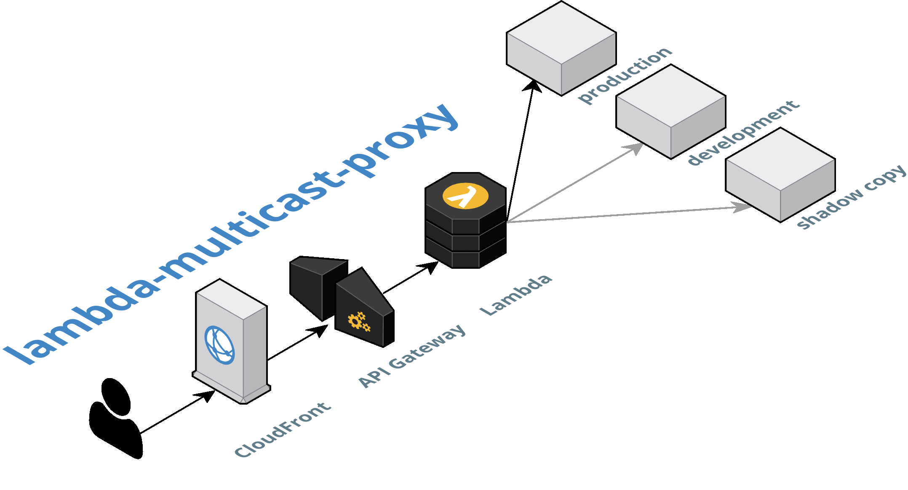

Use AWS Lambda to proxy requests to one **or more** upstream endpoints.

# Why?

There's several use cases for this simple multicast proxy. It can:

1. **Duplicate data input**, so that when a client uploads a value, it's sent both to the production backend and the development one, so you get to play around with live data but in a safe environment.
1. **Load test a shadow copy** of an API endpoint; every request is sent both to the production version and the shadow copy. This allows you to safely determine whether it could take the realistic live load, before actually rolling anything out. Responses from the shadow copy are ignored, and the client only gets the production responses.
1. **Act as a simple HTTP routing layer** in front of your microservices, to support a [blue-green deployment pattern](https://martinfowler.com/bliki/BlueGreenDeployment.html) for example (this doesn't really make use of the multicast feature, though).

# What?

With a simple config file ([see below](#how)), you can create a Lambda function that takes a request like:

    GET https://my-lambda-proxy.com/api/hello/jareware

and rewrites it into these two requests:

    GET https://api.github.com/search/users?q=jareware
    GET https://api.twitter.com/1.1/users/search.json?q=jareware&page=1&count=3

where the first one is the primary, and the secondary is the shadow copy, whose response will be ignored.

# How?

Follow the [initial setup instructions](SETUP.md) to get your AWS environment set up.

As part of that initial setup, you'll create a configuration file like this one:

```js
// https://github.com/jareware/lambda-multicast-proxy
module.exports = JSON.stringify({
  Variables: {
    LAMBDA_MULTICAST_CONFIG: JSON.stringify({

      // How much detail to write to logs (one of 'debug' | 'info' | 'warn' | 'error'):
      logLevel: 'info',

      // How long to wait before giving up on proxied requests:
      proxyTimeout: 5000,

      // When a regex in the key matches, the request will be proxied to the specified list of URL's:
      rewriteConfig: {
        '^/api/hello/(.*)': [
          'https://api.github.com/search/users?q=$1', // first entry is always the primary
          'https://api.twitter.com/1.1/users/search.json?q=$1&page=1&count=3',
        ],
      },

      // These headers from the client are forwarded to the proxy request:
      proxiedIncomingHeaders: [
        'authorization',
        'content-type',
        'user-agent',
        'x-request-id',
      ],

      // These headers from the proxy response are forwarded back to the client:
      proxiedOutgoingHeaders: [
        'content-type',
        'cache-control',
      ],

      // These headers will be added to responses before sending them back to the client:
      // (the ones listed in this example implement a liberal CORS policy; see e.g. https://enable-cors.org/server_nginx.html)
      additionalOutgoingHeaders: {
        'Access-Control-Allow-Origin': '*',
        'Access-Control-Allow-Methods': 'GET, POST, OPTIONS',
        'Access-Control-Allow-Headers': 'DNT,User-Agent,X-Requested-With,If-Modified-Since,Cache-Control,Content-Type,Range',
        'Access-Control-Expose-Headers': 'Content-Length,Content-Range',
        'Access-Control-Allow-Credentials': 'true',
      },

    }),
  },
});
```

Whenever you've made changes to the configuration, you can update it with the official AWS CLI:

```
$ aws lambda update-function-configuration \
    --function-name MyLambdaFunction \
    --environment $(node -p 'require("./lambda-multicast-proxy-config")')
```

# Releasing

Please use the included `release.sh` script.

## First time releasing?

Create a [Personal access token](https://github.com/settings/tokens/new) for the GH API.

# Acknowledgements

Made with the loving support of the [Futurice Open Source sponsorship program](http://futurice.com/blog/sponsoring-free-time-open-source-activities).

Top image made with the sweet [AWS diagram designer at Cloudcraft](https://cloudcraft.co).
